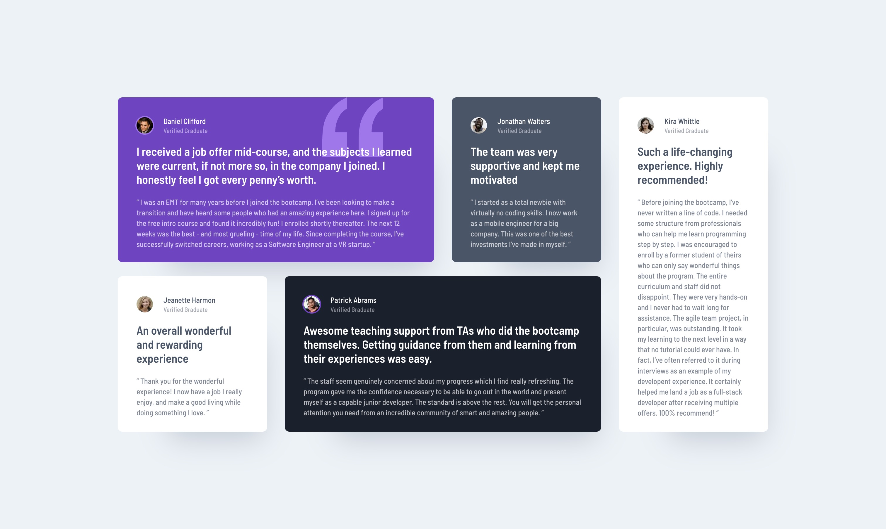

# Frontend Mentor - Testimonials grid section solution

This is a solution to the [Testimonials grid section challenge on Frontend Mentor](https://www.frontendmentor.io/challenges/testimonials-grid-section-Nnw6J7Un7). Frontend Mentor challenges help you improve your coding skills by building realistic projects. 

## Table of contents

- [Overview](#overview)
  - [The challenge](#the-challenge)
  - [Screenshot](#screenshot)
  - [Links](#links)
- [My process](#my-process)
  - [Built with](#built-with)
- [Author](#author)

## Overview

### The challenge

Users should be able to:

- View the optimal layout for the site depending on their device's screen size

### Screenshot

### Links

- Solution URL: [github.com/tloyan/frontendmentor-testimonials-grid-section](https://github.com/tloyan/frontendmentor-testimonials-grid-section)
- Live Site URL: [testimonials-grid-section.tloyan.com](https://testimonials-grid-section.tloyan.com/)

## My process

### Built with

- [React](https://react.dev/)
- [Next.js](https://nextjs.org/)
- [TypeScript](https://www.typescriptlang.org/)
- [Tailwind CSS](https://tailwindcss.com/)

## Author

- Website - [Thomas Loyan](https://www.thomasloyan.com)
- Frontend Mentor - [@tloyan](https://www.frontendmentor.io/profile/tloyan)
